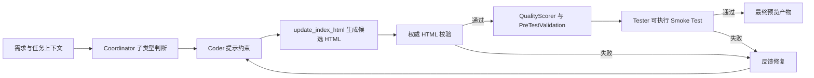

## User Requirements

定位当前 web-app 产物为什么会生成出“能打开但不可用”的页面问题，并给出一套可持续的防回归方案。重点不是继续手工修单个页面，而是找出生成链路、保存合并、预检查和测试阶段的缺口，避免以后再次产出布局异常、交互失效、提示与真实状态不一致的 HTML。

## Product Overview

当前需要改进的是产物生成质量保障流程。最终效果应是：生成页不再只是结构完整，而是首屏能稳定显示、核心区域不塌陷、关键按钮和交互真实生效、提示文案与实际状态一致；若产物存在问题，应在进入最终预览前被自动拦截并反馈修复。

## Core Features

- 按页面类型区分生成规范，避免所有 web-app 都被同一套模板约束带偏
- 在保存、合并、预检查阶段增加可运行性校验，而不只做文本和结构检查
- 将测试从“读代码给意见”升级为“真实执行并验证核心交互”
- 为已出现的故障模式补充回归用例，防止同类问题再次流入最终产物

## Tech Stack Selection

- 后端主链路沿用现有 Python 服务架构，核心修改落在 `backend/app/services`
- 任务编排继续使用 `CoordinatorService`
- 产物保存、合并、预测试校验继续基于 `OutputManager`
- 质量门禁继续基于 `QualityScorer`
- 自动化回归沿用现有 `backend/tests` 的 pytest 体系
- 实施后的浏览器级复验可使用现有 `agent-browser` 能力做 smoke test

## Implementation Approach

### 总体策略

这次不建议再靠增加更多静态正则去“猜”页面是否可用，而是把方案拆成四层：先让生成提示按产物类型对齐真实需求，再让保存/合并流程减少侵入式改写，再给最终 `index.html` 增加统一的语法与可运行性校验，最后把 tester 从文本评审升级为可执行 smoke test。这样既能解释现有问题为什么漏出，也能在最小改动下建立持续防线。

### 已确认的主要根因

- `coordinator.py` 的 web-app 约束高度偏向 Canvas 游戏模板，容易让非 Canvas 或 DOM 交互页朝错误实现范式生成。
- coder 完成后只做 `validate_code_completeness()`，主要检查截断、闭合和括号，不验证真实渲染与交互。
- `update_index_html()` 会直接覆盖 `index.html`，`consolidate_web_app()` 还会继续抽脚本、去重和重注入，但没有“改写后再验证”的闭环。
- `quality_scorer.py` 与 `pre_test_validation()` 都是静态规则，能识别“像不像完整页面”，识别不了“页面是否真的能玩、提示是否与真实行为一致”。
- tester 阶段目前仍是把代码文本交给 LLM 评论，不是真执行，因此容易漏掉点击后、异步结算后、随机状态下才暴露的问题。

### 关键技术决策

1. 引入 web-app 子类型判断。建议在 `CoordinatorService` 中基于原始需求和任务上下文区分至少三类：`canvas-game`、`dom-game`、`interactive-page`。不同子类型使用不同提示约束和校验规则，替代当前“一刀切必须 canvas”的策略。
2. 把 `index.html` 设为“权威产物”。当 `update_index_html()` 已拿到完整单文件 HTML 时，后续应优先做校验和备份，而不是无条件再次 `consolidate_web_app()` 重写；合并逻辑只作为缺失或碎片化产物的兜底恢复路径。
3. 增加分层校验而非一次性大门禁。推荐顺序为：文本完整性检查、HTML/JS 语法检查、子类型结构检查、最小运行时 smoke 检查、tester 执行验证。前一层失败就尽早反馈，避免把坏产物继续下发。
4. 将 tester 升级为“可执行验证”。第一阶段先做最小 DOM/脚本级自测与统一 smoke 规则；第二阶段再补浏览器级首屏、控制台和关键交互回归。这样能先低风险落地，再逐步提高覆盖率。
5. 对高成本校验做范围控制。静态与语法检查只针对最终候选 `index.html`，复杂 smoke test 只在 web-app 最终产物或修复迭代时运行，避免对整条流水线造成不必要的时延。

### 性能与可靠性

- 静态解析、正则和结构校验基本是对单个 HTML/JS 文本的线性扫描，复杂度为 O(n)。
- 语法检查可采用“有 Node 则执行、无 Node 则降级告警”的 best-effort 策略，避免环境缺失时整条流程硬失败。
- 浏览器级 smoke 是最贵的一层，应只对最终候选页执行，并在静态校验通过后再运行，降低总体开销和噪声。
- 所有 web-app 新逻辑应严格限定在 `target_output == "web-app"` 分支，避免影响 Godot 等现有输出类型。

## Implementation Notes

- `consolidate_web_app()` 不能继续默认重写一个已经有效的单文件 `index.html`；先判定“是否需要合并”，再决定是否改写。
- `pre_test_validation()` 与 `quality_scorer.py` 应共享同一份验证结果来源，避免两套规则各自漂移。
- 对自动修补逻辑要保守，优先“报错并反馈”而不是“静默改写”，否则容易再次制造结构过关但行为变差的页面。
- 浏览器级 smoke 适合作为最终门禁或实现后复验，不建议一开始就塞进每个中间步骤。
- 低风险落地顺序应是：先提示与权威 HTML 策略，再静态/语法校验，再 tester 执行验证，最后补更深的运行时约定。

## Architecture Design

### 目标链路



### 组件职责

- `CoordinatorService`：识别 web-app 子类型，生成更匹配的 coder/tester 指令，并决定何时进入修复迭代。
- `OutputManager`：管理 `index.html` 的权威写入、兜底合并、语法检查、结构检查和最小运行校验。
- `QualityScorer`：从“静态像不像”升级为“是否满足该子类型的可运行性信号”。
- tester 流程：从阅读代码文本升级为执行统一 smoke 规则并回传可操作问题。
- 测试层：覆盖保存、合并、评分、预测试和真实故障模式的回归用例。

## Directory Structure

### Directory Structure Summary

本次改造集中在 web-app 生成链路，不建议扩大到 API 层或无关模块。核心是收紧提示、减少破坏性合并、增加可运行性门禁，并为这些门禁补自动化测试。

```text
/Users/lindeng/AITeam/
├── backend/app/agents/base.py                         # [MODIFY] 调整 CoderAgent 的 web-app 规则，改为按 DOM 页 / Canvas 游戏 / 交互页区分要求；补充“输出必须与页面类型匹配、核心交互必须可执行”的约束，避免为了满足静态模板而偏航。
├── backend/app/services/coordinator.py                # [MODIFY] 在 web-app 链路中增加子类型判断、权威 HTML 流程控制和更强的 tester 反馈闭环；避免无条件合并有效 index.html，并把验证失败准确送回修复迭代。
├── backend/app/services/output_manager.py             # [MODIFY] 重构 update/consolidate/validation 链路：区分权威 HTML 与兜底合并、增加 JS/HTML 语法与可运行性检查、输出统一验证结果、减少静默自动修补。
├── backend/app/services/quality_scorer.py             # [MODIFY] 让评分从纯静态匹配升级为子类型感知评分，并吸收 runtime/validation 结果，降低“结构好看但行为错误”的高分误判。
├── backend/tests/test_output_manager.py               # [MODIFY] 扩展到 update_index_html、consolidate_web_app、pre_test_validation 的关键回归，覆盖“有效 index 不应被破坏性重写”等高风险路径。
├── backend/tests/test_service_regressions.py          # [MODIFY] 增加 coordinator 级回归，验证子类型分支、验证失败反馈、跳过不必要 consolidate 等编排行为。
├── backend/tests/test_quality_scorer.py               # [NEW] 为 QualityScorer 建立独立测试，覆盖 DOM 页、Canvas 页、运行时异常信号、误判场景与阈值判定。
└── backend/tests/test_web_output_validation.py        # [NEW] 为 web 产物可运行性建立代表性回归样例，覆盖布局塌陷、状态提示假成功、无可走步未真洗牌、关键 DOM 缺失等真实故障模式。
```

## Key Code Structures

- 建议新增统一的 web 校验结果结构，由 `OutputManager` 产出，至少包含：`passed`、`errors`、`warnings`、`syntax_checks`、`structure_checks`、`runtime_checks`。`CoordinatorService` 和 `QualityScorer` 共用这份结果，避免多套规则分叉。
- 建议把 web-app 子类型作为明确上下文在 `CoordinatorService` 内部流转，而不是靠提示词临时猜测。这样 prompt、评分和测试可以使用同一分类。
- 建议将“权威 HTML”与“兜底合并”分成两条路径：前者以保持正确产物为主，后者只在缺失完整单文件时启动，防止 `consolidate_web_app()` 成为新的破坏源。

## Agent Extensions

- **skill:agent-browser**
- Purpose: 在实现完成后对最终产物页执行真实浏览器 smoke 验证，检查控制台错误、首屏渲染和关键交互链路。
- Expected outcome: 捕获静态规则和文本评审无法发现的运行时、布局和点击行为问题。